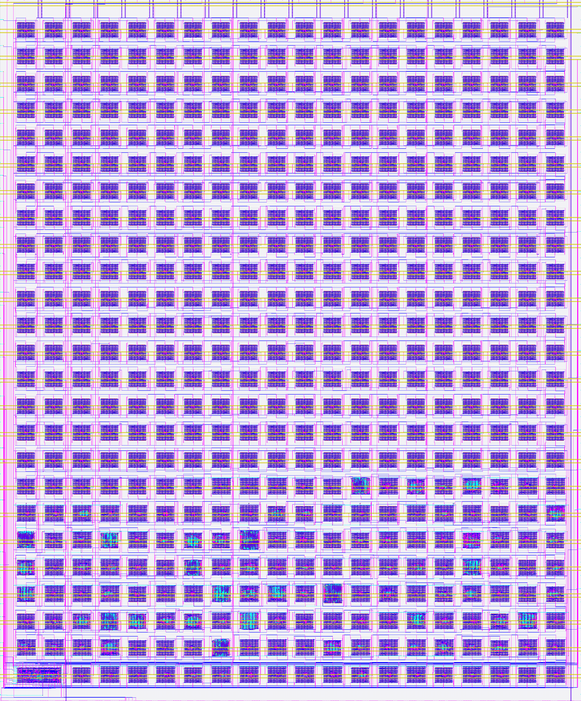

# Tiny Tapeout Chip Renders

This repo contains the chip renders for all Tiny Tapeouts shuttles. Each shuttle includes two renders:

- full_gds.png: A full render of the GDS file.
- logic_density: Shows only the local interconnect layer, which is used to estimate the logic density of the chip.

For Tiny Tapeout 4 and later, the renders include the complete chip area, including the pads, and the caravel harness. For earlier shuttles, the renders only include the core area.

The renders are generated using the [render.py](scripts/render.py) script, which uses [klayout](https://www.klayout.org/) to render the GDS files. See [below](#regenerating-the-renders) for instructions on how to regenerate the renders.

## Full Renders

### Tiny Tapeout 7

[](shuttles/tt07/full_gds.png)

### Tiny Tapeout 6

[](shuttles/tt06/full_gds.png)

### Tiny Tapeout 5

[](shuttles/tt05/full_gds.png)

### Tiny Tapeout 4

[](shuttles/tt04/full_gds.png)

### Tiny Tapeout 03p5

[](shuttles/tt03p5/full_gds.png)

### Tiny Tapeout 3

[](shuttles/tt03/full_gds.png)

### Tiny Tapeout 2

[](shuttles/tt02/full_gds.png)

### Tiny Tapeout 1

[](shuttles/tt01/full_gds.png)

## Logic Density Renders

* [Tiny Tapeout 7](shuttles/tt07/logic_density.png)
* [Tiny Tapeout 6](shuttles/tt06/logic_density.png)
* [Tiny Tapeout 5](shuttles/tt05/logic_density.png)
* [Tiny Tapeout 4](shuttles/tt04/logic_density.png)
* [Tiny Tapeout 03p5](shuttles/tt03p5/logic_density.png)
* [Tiny Tapeout 3](shuttles/tt03/logic_density.png)
* [Tiny Tapeout 2](shuttles/tt02/logic_density.png)
* [Tiny Tapeout 1](shuttles/tt01/logic_density.png)

## Regenerating the renders

To regenerate the PNG files for a shuttle, run the following commands:

```bash
cd scripts
pip install -r requirements.txt
python render.py <shuttle>
```

Where `<shuttle>` is the identifier of the shuttle (e.g. tt04).

You can also specify the scale of the render by passing the `--scale` argument. For example, to render the full GDS of shuttle tt04 at 2x scale:

```bash
python render.py tt04 --scale 2
```

## License

The chip renders are licensed under the [CC BY 4.0](https://creativecommons.org/licenses/by/4.0/) license.